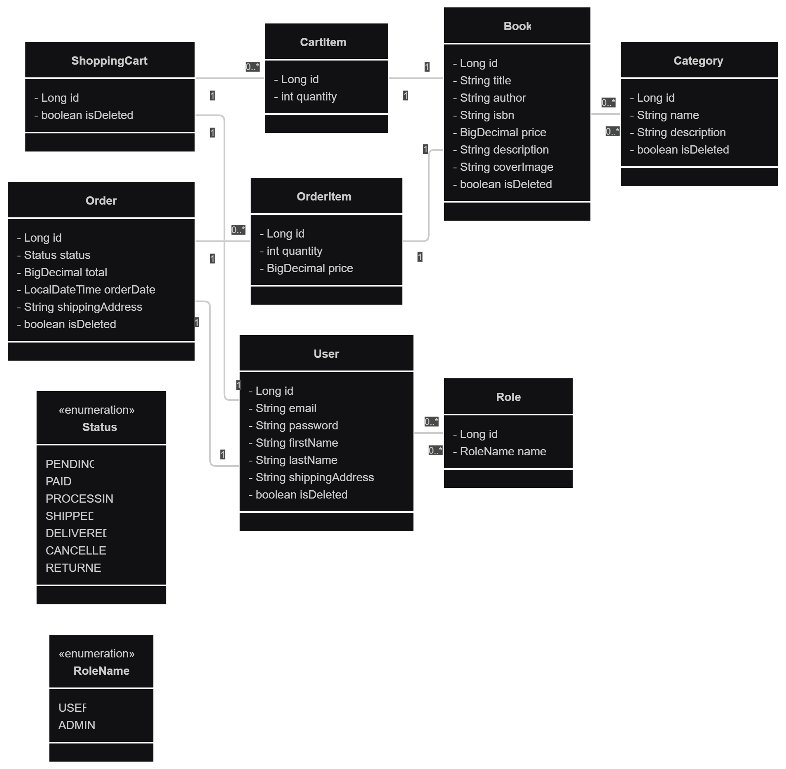

# Online Book Store Application

<p>
  
  <strong>Online Book Store — Spring Boot REST API</strong><br/>
  A production-ready REST API for managing books, categories, shopping carts, and orders — featuring secure JWT authentication and a clean layered architecture.<br/>
  Built as a portfolio project and educational example of a modern Spring Boot backend.
</p>

---

## Table of Contents

- [Tech Stack](#tech-stack)
- [How to Run the Project with Docker](#how-to-run-the-project-with-docker)
- [Controllers Overview](#controllers-overview)
- [Postman Collection](#postman-collection)
- [Entity Relationship Diagram](#entity-relationship-diagram-)
---

## Tech Stack

[](#)
[](#)
[](#)
[](#)
[](#)
[](#)
[](#)
[-green.svg)](#)
[](#)
[](#)
[](#)
[](#)
[](#license)

---

## How to Run the Project with Docker

This guide explains how to run the **Online Book Store Application** on a clean computer using **Docker** only.

---

## Prerequisites

1. Install **Docker Desktop** (Windows / macOS) or **Docker Engine + Docker Compose** (Linux).
2. (Windows only) Enable **WSL2** when prompted during Docker Desktop installation.

---

### Step 1: Clone the Repository

https://github.com/vDmytriv01/book-store-app.git

---

### Step 2: Environment Configuration

Create a `.env` file in the project root directory (you can copy from `.env.template`).

```bash
MYSQLDB_USER=docker_user
MYSQLDB_PASSWORD=docker_pass
MYSQLDB_DATABASE=bookstore_db_docker
MYSQLDB_ROOT_PASSWORD=RootPass123!

MYSQLDB_LOCAL_PORT=3307
MYSQLDB_DOCKER_PORT=3306

SPRING_LOCAL_PORT=8088
SPRING_DOCKER_PORT=8080
DEBUG_PORT=5005

SPRING_PROFILES_ACTIVE=docker

JWT_SECRET=Jf8s9d2l@Kc3qX7rWz1hVp5oTn9yL6mGq2rBt8uF0jE4sY7wP
```

---

### Step 3: Start Containers

```bash
docker compose up --build
```

### Step 4: Stop Containers
```bash
docker compose stop
```

---

## Controllers Overview

Each module in the application exposes a dedicated REST controller responsible for handling specific domain logic.

### AuthenticationController

- `POST /auth/registration` — register a new user account.
- `POST /auth/login` — authenticate and return a JWT token.

### BookController

- `GET /books` — retrieve all books with pagination and sorting.
- `GET /books/{id}` — get book details by ID.
- `POST /books` — create a new book *(admin)*.
- `PUT /books/{id}` — update existing book *(admin)*.
- `DELETE /books/{id}` — soft delete a book *(admin)*.
- `GET /books/search` — search by title, author, ISBN, or price range.

### CategoryController

- `GET /categories` — list all categories with pagination.
- `GET /categories/{id}` — get category details.
- `POST /categories` — create a new category *(admin)*.
- `PUT /categories/{id}` — update category *(admin)*.
- `DELETE /categories/{id}` — soft delete *(admin)*.
- `GET /categories/{id}/books` — get all books in a category.

### ShoppingCartController

- `GET /cart` — view user’s current shopping cart.
- `POST /cart` — add a book to the cart.
- `PUT /cart/items/{cartItemId}` — update book quantity.
- `DELETE /cart/items/{cartItemId}` — remove a book from the cart.

### OrderController

- `POST /orders` — place an order using items from the cart.
- `GET /orders` — get user’s order history.
- `GET /orders/{id}/items` — get items in a specific order.
- `GET /orders/{orderId}/items/{itemId}` — get a single order item.
- `PATCH /orders/{id}` — update order status *(admin)*.

---

## Postman Collection

You can easily test all API endpoints using **Postman**.

1. Open **Postman** and go to **File → Import**.
2. Import the following two files from the `/postman` folder:

- [book-store-app.postman_collection.json](docs/postman/book-store-app.postman_collection.json)
- [book-store-app_environment.template.json](docs/postman/book-store-app_environment.template.json)

3. Select the imported **environment** in the top-right corner of Postman.

> The environment file already includes:
> - `baseUrl`: `http://localhost:8088/api`
> - admin credentials:
> - email: admin@mail.com
> - password: 12345678

4. Run the **Login** request — the JWT token will be saved automatically and used in all secured requests.
5. You can now explore all endpoints for **Books**, **Categories**, **Cart**, **Orders**, and **Auth**.

---

## Entity Relationship Diagram 


